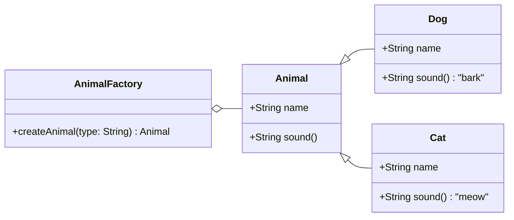

<h1><span>Python でファクトリメソッド</span></h1>

<div>ナイトウ <a href="https://twitter.com/engineer_naito"><carbon-logo-twitter /></a></div>

<div class="pt-12">
  <span @click="$slidev.nav.next" class="px-2 py-1 rounded cursor-pointer" hover="bg-white bg-opacity-10">
    Press Space for next page <carbon-arrow-right class="inline"/>
  </span>
</div>

<div class="abs-br m-6">
  {{ nowStrRef }}
</div>

<script setup lang="ts">
import { ref, onMounted } from "vue";

const now = new Date();
const nowStr = now.toLocaleString();
const nowStrRef = ref(nowStr);

function tick() {
  const newTime = new Date();
  const newTimeStr = newTime.toLocaleString();
  nowStrRef.value = newTimeStr;
}

onMounted(() => {
  setInterval(tick, 1000);
  tick();
})
</script>

<style>
h1 span {
  background: -webkit-linear-gradient(315deg, #FFD343 50%, #3776AB);
  background-clip: text;
  -webkit-background-clip: text;
  -webkit-text-fill-color: transparent;
}
</style>

<!--
The last comment block of each slide will be treated as slide notes. It will be visible and editable in Presenter Mode along with the slide. [Read more in the docs](https://sli.dev/guide/syntax.html#notes)
-->

---
layout: two-cols
layoutClass: gap-16
title: ToC
transition: view-transition
---


<ul>
  <li>
    <a href="https://twitter.com/engineer_naito" target="_blank" rel="noopener noreferrer">
      <carbon-logo-twitter /> 旧 Twitter <carbon-new-tab />
    </a>
  </li>
  <li>
    <a href="https://github.com/kosuke222naito" target="_blank" rel="noopener noreferrer">
      <carbon-logo-github /> GitHub <carbon-new-tab />
    </a>
  </li>
  <li>
    <a href="https://zenn.dev/kosuke_naito" target="_blank" rel="noopener noreferrer">
      <carbon-blog /> Zenn <carbon-new-tab />
    </a>
  </li>
</ul>

::right::

<h1>
  <span class="text-gradation">Table of Contents</span>
</h1>

<Toc minDepth="1" maxDepth="1"></Toc>

---
transition: slide-left
title: 自己紹介
layout: two-cols
layoutClass: gap-16
---


<ul>
  <li>
    <a href="https://twitter.com/engineer_naito" target="_blank" rel="noopener noreferrer">
      <carbon-logo-twitter /> 旧 Twitter <carbon-new-tab />
    </a>
  </li>
  <li>
    <a href="https://github.com/kosuke222naito" target="_blank" rel="noopener noreferrer">
      <carbon-logo-github /> GitHub <carbon-new-tab />
    </a>
  </li>
  <li>
    <a href="https://zenn.dev/kosuke_naito" target="_blank" rel="noopener noreferrer">
      <carbon-blog /> Zenn <carbon-new-tab />
    </a>
  </li>
</ul>

<br />

<Tweet
  id="1764917140338147519"
  scale="0.6"
  v-click="2"
/>

::right::

<h1>
  <span class="text-gradation">I'm ナイトウ</span>
</h1>

<ul class="text-xl">
  <li v-click>
    <span class="python-gradation">Python</span> <carbon-logo-python /> で Web バックエンド
  </li>
  <li v-click>Web フロントもやりたい</li>
  <li v-after><span class="text-gradation">Vue</span> <carbon-logo-vue/> が好き</li>
  <li v-click>since: 2021 ({{ years }}年目)</li>
  <li v-after>駆け出しエンジニア？ (非 CS 専攻)</li>
  <li v-click><span text-yellow>柏</span> (<a href="https://toukatsu.connpass.com/">東葛dev</a> 運営？)</li>
  <li v-click><span v-mark>自作キーボード</span></li>
  <li v-click>新本格ミステリ</li>
  <li v-click>エヴァ、シュタゲ</li>
  <li v-click text-white text-op-25>元ハロヲタ (until: 2022)</li>
</ul>

<script setup lang="ts">
import { ref } from "vue";
const now = new Date();
const START_DATE = new Date(2021, 1, 1);
const years = now.getFullYear() - START_DATE.getFullYear() + 1;
</script>

<style>
.text-gradation {
  background: linear-gradient(45deg, #52D422, #2266D4);
  background-clip: text;
  -webkit-background-clip: text;
  -webkit-text-fill-color: transparent;
  background-size: 400% 400%;
}

h1 span.text-gradation {
  animation: GradientBackground 3s ease infinite;
}

ul li span.text-gradation {
  animation: GradientBackground 5s ease infinite;
}

.python-gradation {
  background: linear-gradient(45deg, #3776AB, #FFD43B);
  background-clip: text;
  -webkit-background-clip: text;
  -webkit-text-fill-color: transparent;
  background-size: 400% 400%;
  animation: GradientBackground 5s ease infinite;
}

@keyframes GradientBackground {
  0% {
    background-position: 0% 50%;
  }

  50% {
    background-position: 100% 50%;
  }

  100% {
    background-position: 0% 50%;
  }
};
</style>

<!--
You can have `style` tag in markdown to override the style for the current page.
Learn more: https://sli.dev/guide/syntax#embedded-styles
-->

<!--
Here is another comment.
-->

---
layout: cover
class: text-center
---

# ファクトリメソッド について

---
transition: slide-up
level: 2
---

# ファクトリメソッド #とは

> 他のクラスのコンストラクタをサブクラスで上書き可能な自分のメソッドに置き換えることで、
>
> アプリケーションに特化したオブジェクトの生成をサブクラスに追い出し、クラスの再利用性を高めることを目的とする

<br />

<a href="https://ja.wikipedia.org/wiki/Factory_Method_%E3%83%91%E3%82%BF%E3%83%BC%E3%83%B3">
  <carbon-wikis />
  Factory Method パターン - Wikipedia
</a>

<br />
<br />

<span v-mark>クラス図</span>

<v-after>



</v-after>

---
transition: slide-up
level: 2
---

# ファクトリメソッドのいいところ

<ol>
  <li v-click>再利用性の向上</li>
  <li v-click><span v-mark.circle.yellow="{ at: 4 }">変更の容易さ</span></li>
  <li v-click>可読性の向上</li>
</ol>

---
transition: slide-up
layout: two-cols
---

# Python での例

```python{all|3-10|12-24|none}{lines:true}
from abc import ABC, abstractmethod

class Animal(ABC):
    @abstractmethod
    def __init__(self, name):
        self.name = name

    @abstractmethod
    def speak(self):
        pass

class Dog(Animal):
    def __init__(self, name):
        super().__init__(name)

    def speak(self):
        return "Woof!"

class Cat(Animal):
    def __init__(self, name):
        super().__init__(name)

    def speak(self):
        return "Meow!"
```

::right::

```python{none|26-34|37,38}{lines:true, startLine:26}
class AnimalFactory:
    @staticmethod
    def create_animal(animal_type, name):
        if animal_type == "dog":
            return Dog(name)
        elif animal_type == "cat":
            return Cat(name)
        else:
            raise ValueError("Unknown animal type")


dog = AnimalFactory.create_animal("dog", "Buddy")
cat = AnimalFactory.create_animal("cat", "Whiskers")

print(dog.speak())  # "Woof!"
print(cat.speak())  # "Meow!"
```

---
transition: slide-left
---

# ファクトリメソッドを採用した経緯

<v-clicks>

- 現在チャットbotを利用したアプリを作成中(PoC)
- 外部のAPIサービスを利用して実現する必要がある
- しかしサービス選定の時間はない

</v-clicks>

<br />
<br />

<div v-click>そこで利用するサービスに依存せず</div>
<div v-after><span v-mark.blue>コードの変更を簡単にしたい</span></div>

---
transition: view-transition
---

# 実際の使用例(チャットbot)

<br />

インターフェース(抽象基底クラス)の定義

```python{all|4-7|10,11}{lines:true}
from abc import ABC, abstractmthod
from enum import Enum

class ChatBot(ABC):
    @abstractmethod
    def genrerate_response(self, messages) -> str:
        pass


class ChatBotServices(Enum):
    OPENAI = "openai"
```

---
transition: view-transition
level: 2
---

# 実際の使用例(チャットbot)

<br />

具象クラスの作成(OpenAI API)

```python{all|7-14}{lines:true}
from openai import OpenAI

class OpenAIChatBot(ChatBot):
    def __init__(self):
        self.chatgpt_client = OpenAI(api_key=OPEN_AI_API_KEY)

    def genrerate_response(self, messages) -> str:
        completion = self.chatgpt_client.chat.completions.create(
            messages=messages,
            model="gpt-4o",
        )
        content = completion.choices[0].message.content

        return content
```

---
transition: view-transition
level: 2
---

# 実際の使用例(チャットbot)

<br />

ファクトリ

```python{all|13,14|17}{lines:true}
class ChatBotFactory:
    _class: dict[str, type[ChatBot]] = {}

    @classmethod
    def register(cls, chat_bot_service: ChatBotServices):
        def wrapper(cls_):
            cls._class[chat_bot_service.value] = cls_
            return cls._class[chat_bot_service.value]

        return wrapper

    @classmethod
    def get_chat_bot_class(cls, chat_bot_service: ChatBotServices):
        return cls._class[chat_bot_service.value]


ChatBotFactory.register(ChatBotServices.OPENAI)(OpenAIChatBot)
```

---
transition: slide-left
level: 2
---

# 実際の使用例(チャットbot)

<br />

ファクトリでインスタンスを作成

```python{all}{lines:true}
ChatBotClass = ChatBotFactory.get_chat_bot_class(ChatBotServices.OPENAI)
chat_bot = ChatBotClass()
```

---
transition: slide-left
level: 2
---

# これがやりたかった

```python{none|2|3|4}{lines:true}
ChatBotFactory.register(ChatBotServices.OPENAI)(OpenAIChatBot)
ChatBotFactory.register(ChatBotServices.CLAUDE)(ClaudeChatBot)
ChatBotFactory.register(ChatBotServices.GOOGLE_GEMINI)(GoogleGeminiChatBot)
ChatBotFactory.register(ChatBotServices.MICROSOFT_BING)(MicrosoftBingChatBot)
```

<span v-click>柔軟に使うサービスを選択できる</span>

<v-click>

````md magic-move
```python{all}{lines:true}
ChatBotClass = ChatBotFactory.get_chat_bot_class(ChatBotServices.OPENAI)
chat_bot = ChatBotClass()
chat_bot_response = chat_bot.generate_response(messages)
```

```python{all}{lines:true}
ChatBotClass = ChatBotFactory.get_chat_bot_class(ChatBotServices.CLAUDE)
chat_bot = ChatBotClass()
chat_bot_response = chat_bot.generate_response(messages)
```

```python{all}{lines:true}
ChatBotClass = ChatBotFactory.get_chat_bot_class(ChatBotServices.GOOGLE_GEMINI)
chat_bot = ChatBotClass()
chat_bot_response = chat_bot.generate_response(messages)
```

```python{all}{lines:true}
ChatBotClass = ChatBotFactory.get_chat_bot_class(ChatBotServices.MICROSOFT_BING)
chat_bot = ChatBotClass()
chat_bot_response = chat_bot.generate_response(messages)
```
````

</v-click>

---
transition: slide-left
level: 2
---

# ファクトリメソッドのあんまりよくないところ

<div v-click>使わない場合に比べてコードが<span v-mark.blue="{ at: 2 }">複雑</span>(難解)になる</div>
